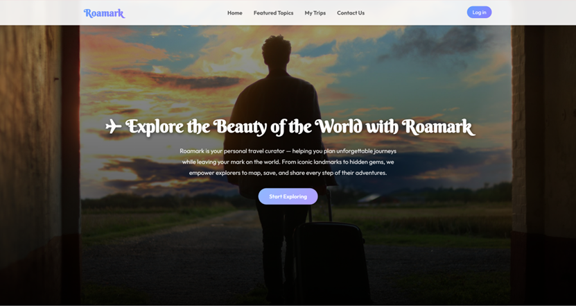
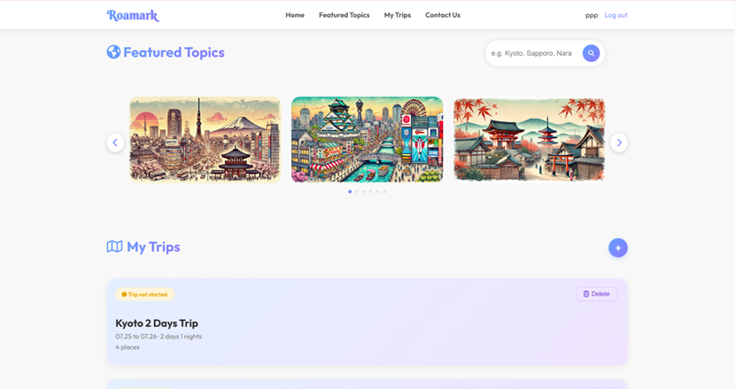
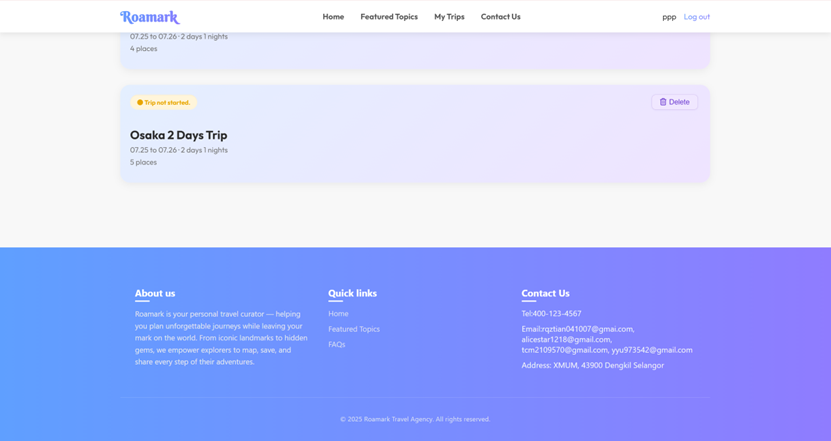
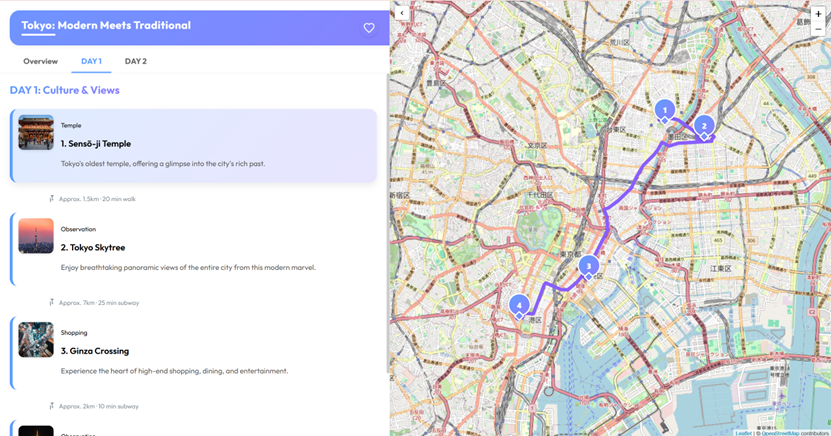
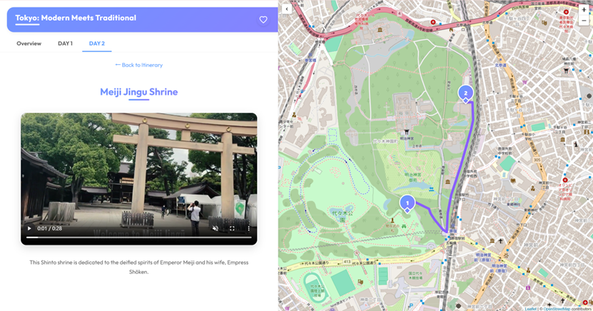
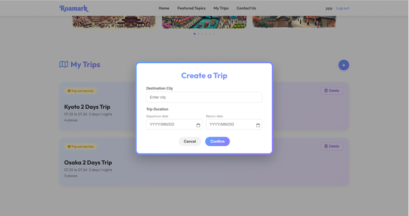
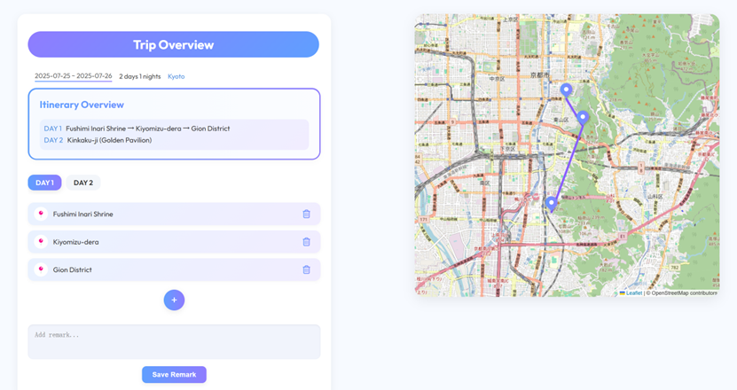

# Roamark - Your Personalized Travel Planner

Roamark is a personal travel planning platform designed to help you plan unforgettable journeys and leave your footprints in the world. From iconic landmarks to hidden gems, we empower explorers to map, save and share their adventures every step of the way.

## Features
- Destination Explorer: Get inspired with maps, video guides, and itinerary suggestions for unique destinations around the world.
- Personalized Trip Planner (MyTrip): Allows users to create customized itineraries and provides an interactive map-based interface to visualize travel routes.

## Technology stack
- **Frontend**: HTML, CSS, JavaScript
- **Map**: OpenStreetMap Nominatim API
- **Database**:  Firebase Firestore

##  Contributors & Responsibilities

| Module | Description | Contributor |
|--------|-------------|-------------|
| Featured Topics Page | Responsible for the featured theme display on the homepage, including carousel and search functions. | `@Peng Xinyun` |
| Website CSS Style and User Interface | Responsible for the overall visual design of the website, the unified style of the pages and the responsive layout. | `@Gu Menghan` |
| MyTrip Page & Map Features| Responsible for the core functionality of my travel page, interactive maps, and route planning. | `@Yu Yifan` |
| Database Integration & User Auth | Responsible for user data storage, itinerary management, login registration, forgotten password and help center pages.| `@Ruan Qiuzi` |

##  Screenshots

